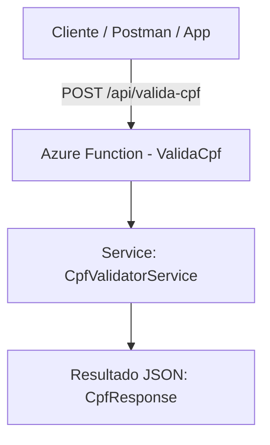

# 🔍 Azure Function - Validação de CPF

Este projeto implementa um **microserviço Serverless** para **validação de CPF**, desenvolvido em **.NET 8 com Azure Functions**.

## 🚀 Objetivo
Permitir a validação de CPFs via requisições HTTP, retornando se o número informado é válido segundo as regras oficiais do CPF brasileiro.

---

## 🧱 Arquitetura



- **Azure Function (HTTP Trigger)** — Responsável por receber a requisição POST e orquestrar a validação.
- **Service Layer** — Implementa a lógica de negócio (validação do CPF).
- **Model Layer** — Representa os objetos de entrada e saída.

---

## ⚙️ Stack Técnica
- .NET 8  
- Azure Functions v4  
- Visual Studio 2022  
- Newtonsoft.Json  
- C# 12  

---

## 📬 Exemplo de Requisição

**POST**
```
https://<sua-funcao>.azurewebsites.net/api/valida-cpf
```

**Body**
```json
{
  "cpf": "12345678909"
}
```

**Response**
```json
{
  "cpf": "12345678909",
  "valido": true,
  "mensagem": "CPF válido."
}
```

---

## 🧑‍💻 Desenvolvimento Local

1. Clone o repositório:
   ```bash
   git clone https://github.com/<seu-usuario>/azure-func-valida-cpf.git
   cd azure-func-valida-cpf/src/ValidaCpfFunctionApp
   ```

2. Configure o ambiente local:
   - Abra no **Visual Studio 2022**
   - Certifique-se de que o SDK .NET 8 e Azure Functions Tools estão instalados.

3. Execute a função localmente:
   ```bash
   func start
   ```
   Endpoint local: `http://localhost:7071/api/valida-cpf`

---

## ☁️ Deploy no Azure

1. Crie um Function App no Azure Portal.  
2. Faça o **deploy direto pelo Visual Studio** (botão direito no projeto → *Publicar no Azure*).  
3. Teste o endpoint público.

---

## 🧠 Autor

**Samuel Rocha**  
System Architect | Azure | .NET | Cloud & Innovation  
📎 [LinkedIn](https://www.linkedin.com/in/samuel-rocha-b74b7959)

---

## 📜 Licença
Este projeto está licenciado sob a licença MIT.
